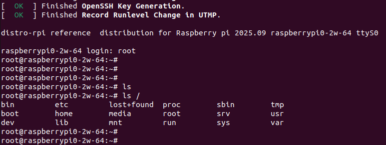
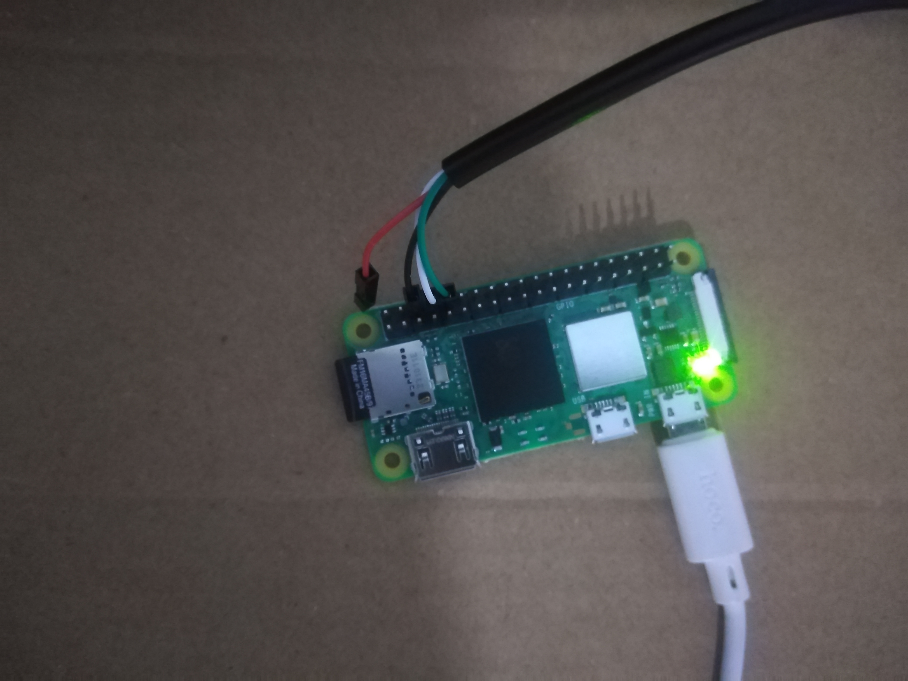
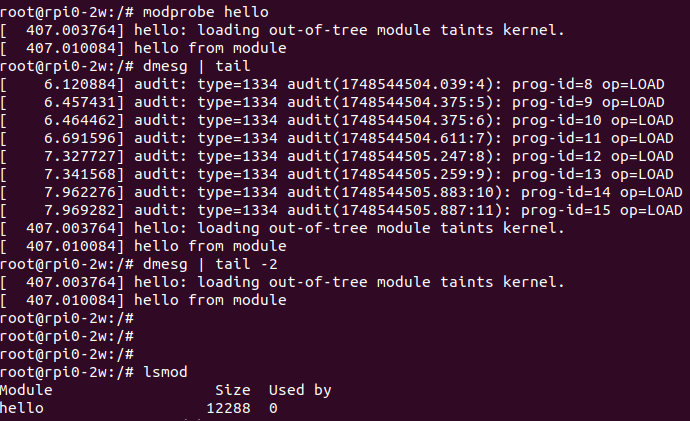

# YOCTO-Project using Raspberry pi02w 
This project aims to learn and practive different ways in yocto build system such as creating image ,developping distro ,BSP ,wrting recipes ..etc 


Using Raspberrypi0 2w 
## Hardware Requirements:
Raspberry Pi Zero 2 W
SD Card (16 GB)

## Project Architecture:

### Main Directories :
- docker 
- kas 
- meta-rpi-bsp
- meta-rpi-distro
- meta-rpi-prj

### Project Goals :

-Prepare KAS yml file for all layers ans local configuration file .
-Develop BSP layer 
-Develop Distro layer without using Poky (from scratch).
-Create images (for development and production )
-......etc 

## Setup process : 
Kas makes the setup of yocto build environment super simple and fast .


  1.install kas :
```bash
git clone https://github.com/siemens/kas.git
```
  2.Commands :
```bash
 kas-container checkout file.yml
  kas-container shell  file.yml 
  kas-container build  file.yml
```

Unmount all partitions :

```bash
host$ umount /dev/<your_device><number>
```

Flash image into SD card :
```bash
host$ sudo dd if=<IMAGENAME>.<Type> of=/dev/<your_device> bs=1MB conv=fsync
```

Connection between board and Computer:
Using :
USB To RS232 TTL UART PL2303.

Install picocom :
```bash
sudo apt-get install picocom
```
 
Running picocom :
```bash
sudo picocom -b 115200 -r -l /dev/ttyUSB0
```

### Test Development image:



#### test rpi login with encrypted password :


#### Testing the board with new machine :
meta-rpi-bsp/conf/machine/*.conf:
This configuration file provides details about the device you are adding.
This file define things such as  the kernel package to use, 
image format, machine features, any bootloader information, target arch ...e.g. 

Result:

```bash
distro-rpi reference  distribution for Raspberry pi 2025.09 rpi0-2w ttyS0

rpi0-2w login: root
root@rpi0-2w:~#
root@rpi0-2w:~#

```




### Kernel Module recipe :
Setup:
-Create module directory under recipes-kernel:
-Create Recipe for kernel module 
-Create files subdirectory contain hello.c and Makefile
-Add the package hello-mod to the image recipe by the varaibel (IMAGE_INSTALL:append)

Test :
To load the kernel module :

```bash
modprobe hello 
```

* To unload the module  


```bash
rmmod hello 
```



