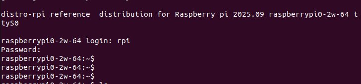
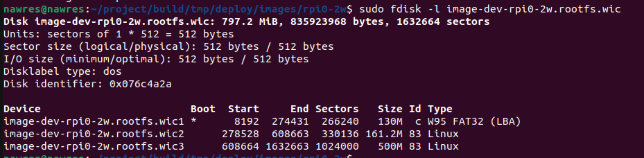
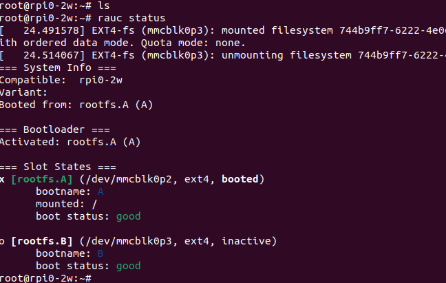

# YOCTO-Project using Raspberry pi02w 
This project aims to learn and practive different ways in yocto build system such as creating image ,developping distro ,BSP ,wrting recipes ..etc 


Using Raspberrypi0 2w 
## Hardware Requirements:
Raspberry Pi Zero 2 W
SD Card (16 GB)

## Project Architecture:

### Main Directories :
- docker 
- kas 
- meta-rpi-bsp
- meta-rpi-distro
- meta-rpi-prj

### Project Goals :

-Prepare KAS yml file for all layers ans local configuration file .

-Develop BSP layer 

-Develop Distro layer without using Poky (from scratch).

-Create images (for development and production )

-......etc 

## Setup process : 
Kas makes the setup of yocto build environment super simple and fast .


  1.install kas :
```bash
git clone https://github.com/siemens/kas.git
```
  2.Commands :
```bash
 kas-container checkout file.yml
  kas-container shell  file.yml 
  kas-container build  file.yml
```

Unmount all partitions :

```bash
host$ umount /dev/<your_device><number>
```

Flash image into SD card :
```bash
host$ sudo dd if=<IMAGENAME>.<Type> of=/dev/<your_device> bs=1MB conv=fsync
```

Connection between board and Computer:
Using :
USB To RS232 TTL UART PL2303.

Install picocom :
```bash
sudo apt-get install picocom
```
 
Running picocom :
```bash
sudo picocom -b 115200 -r -l /dev/ttyUSB0
```

### Test Development image:


#### test rpi login with encrypted password :




#### Testing the board with new machine :
meta-rpi-bsp/conf/machine/*.conf:
This configuration file provides details about the device you are adding.
This file define things such as  the kernel package to use, 
image format, machine features, any bootloader information, target arch ...e.g. 

Result:

```bash
distro-rpi reference  distribution for Raspberry pi 2025.09 rpi0-2w ttyS0

rpi0-2w login: root
root@rpi0-2w:~#
root@rpi0-2w:~#

```


### Kernel Module recipe :
Setup:
-Create module directory under recipes-kernel:
-Create Recipe for kernel module 
-Create files subdirectory contain hello.c and Makefile
-Add the package hello-mod to the image recipe by the varaibel (IMAGE_INSTALL:append)

Test :
To load the kernel module :

```bash
modprobe hello 
```

* To unload the module  


```bash
rmmod hello 
```


### Boot time optimization:

Remove unecessary features:

(CONFIG_PRINTK=n) will have the same effect as the quiet command line argument
but you won’t have any access to kernel messages

This is done by  opening the kernel menuconfig, 
disable the features, and saving the configuration to the defconfig file.


# Adding Data partition :
Using wks file (kickstart file).

The partition was mounted automatically because we specified the mountpoint .
In other case  you can the mount point using Fstab file .





### OTA update (RAUC):
#### Rauc Concept:

#### Steps :
-Add meta-rauc to bblayers.conf
 
-Add  a configuration file in recipes-core/rauc/files/system.conf that will define the RAUC configuration on the target

-after that we append it to the recipe rauc-conf.bbappend

-Create a partition number 2 for rootfs (file wks).

-CReate a bundle image recipe for our update rauc 
(the bundle image is Squashfs filesystem )
 
-Create a certificate and a keyring to Rauc system.conf 
(there is a script provide this )(meta-rauc/scripts/openssl-ca.sh).

-Add the rauc client package to the image target .

-build the bundle recipe 


#### Configuration linux kernel 
From the Linux kernel configuration point of view we only need
 to add support for the SquashFS filesystem by enabling the CONFIG_SQUASHFS=y option.


#### U-Boot and RAUC: Pre-requisites

Install U-boot fw-utils on your filesystem, define u-boot environment offset in
/etc/fw_env.config


Updating with U-Boot :

Add a boot script :
meta-rpi-bsp/recipes-bsp/rpi-u
Mainly based on three variables :

BOOT_ORDER :which slot to boot first 




